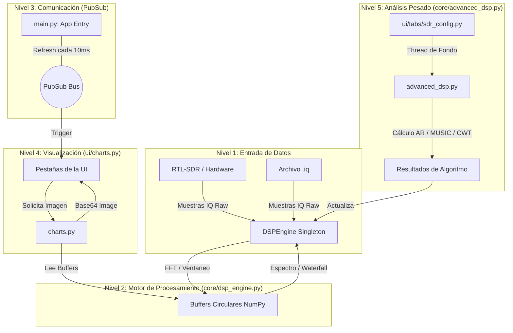

# Conocimiento del Proyecto: UIC Radiotelescopio (Full Documentation)

---

## 📡 1. Visión General

Plataforma avanzada de **Procesamiento Digital de Señales (DSP)** para radioastronomía, optimizada para la detección de la línea de **Hidrógeno Neutro (HI) a 21 cm (1420.405 MHz)**. entre ootros en un rango de 1 a 6 GHz.

### 🗺️ Mapa de Conexiones del Sistema

---

## 🧬 2. Arquitectura Interna y Lógica de Código

### Motor DSP (`core/dsp_engine.py`)

Clase `DSPEngine` (Singleton). Orquesta la vida de la señal.

- **`_process_dsp_core`**: Implementa el pipeline DSP:
  1. Windowing (Hanning).
  2. FFT Shifted Averaging.
  3. DC Offset removal.
  4. Rolling Waterfall update.
  5. SNR estimation (relative to median noise floor).
- **Threading**: Maneja hilos `daemon` para que el cierre de la UI (`main.py`) detenga los cálculos automáticamente.
- **Configuración**: Lee/Escribe `config.json` para persistir rangos de dB, frecuencias y rutas de archivos.

### Algoritmos de Super-Resolución (`core/advanced_dsp.py`)

Módulo especializado en sobrepasar la resolución de Fourier:

- **`run_ar_burg`**: Modelo autorregresivo. Excelente para señales muy débiles entre el ruido.
- **`run_pseudo_music`**: Clasificación de señales mediante descomposición de sub-espacios (EVE).
- **`run_esprit`**: Estimación de parámetros via invarianza rotacional.
- **`run_cwt`**: Transformada Wavelet para detección de RFI (Interferencias) pulsadas.

### Visualización de Alta Velocidad (`ui/charts.py`)

Para lograr ~30 FPS en una app de Python con Matplotlib:

- **`ChartCache`**: Evita la recreación costosa de figuras y ejes (Axes). Solo se modifican los `Artists` existentes.
- **Base64 Pipe**: Los gráficos se envían a la UI como strings Base64 in-memory, eliminando accesos a disco.

---

## 📁 3. Diccionario Completo de Módulos (Directorio a Código)

### `@/core`

- **`constants.py`**: Tema visual (Gris/Cian/Ámbar) y constantes físicas.
- **`dsp_engine.py`**: Corazón del sistema.
- **`advanced_dsp.py`**: Manual matemático.

### `@/ui`

- **`main.py`**: Layout global, manejo de eventos de teclado y loop asíncrono de refresco.
- **`ui/charts.py`**: Driver de visualización científica.
- **`ui/components/layout.py`**: Construcción de Header (botones de pánico y play) y Footer.
- **`ui/components/shared.py`**: Plantillas para Widgets (TextFields, Panels, Borders).
- **`ui/tabs/monitoring.py`**: Pestaña de monitoreo dual (Amplitud + Espectro) con soporte de Zoom mediante Ctrl/Shift + Scroll.
- **`ui/tabs/spectrogram.py`**: Waterfall detallado.
- **`ui/tabs/statistics.py`**: Histograma en tiempo real con ajuste gaussiano automático y "Smart Trigger".
- **`ui/tabs/sdr_config.py`**: Panel lateral. Controla hilos asíncronos para algoritmos avanzados y parámetros de hardware.
- **`ui/tabs/freq_snr.py`**: Tabla de "Señales de Interés" detectadas automáticamente.

### `@/scripts`

- **`create_dummy_iq.py`**: Simulador de señales RTL-SDR.
- **`make_word.py`**: Generador de reportes técnicos del proyecto en formato .docx.

---

## ⚠️ 4. Notas Técnicas de Desarrollo

- **Estructura Redundante**: Existen carpetas como `ui/tabs/tabs/` que contienen copias de archivos. Se debe priorizar SIEMPRE los archivos en el primer nivel de la carpeta correspondiente (ej: `ui/tabs/*.py`).
- **Conexiones PubSub**: El sistema es reactivo. `page.pubsub.send_all("refresh_charts")` es el latido del sistema que actualiza todas las vistas simultáneamente.
- **Rendimiento**: Se prefiere NumPy vectorizado sobre bucles `for`. Los gráficos pesados se ejecutan con `asyncio.to_thread` para no congelar la GUI.
