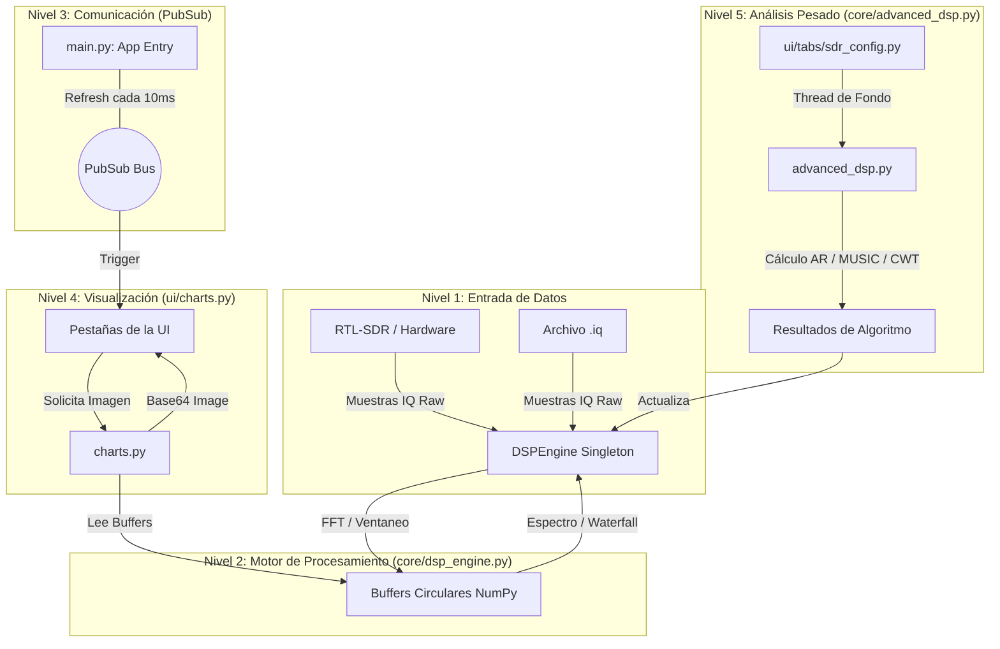

# Proyecto: UIC Radiotelescopio — Plataforma DSP de Radioastronomía

Este documento sirve como referencia técnica completa para que una IA o desarrollador comprenda la arquitectura, el flujo de señales y los algoritmos implementados en el proyecto.

## 📡 1. Visión General
El proyecto es una **estación de trabajo DSP (Digital Signal Processing)** diseñada para la detección y análisis de señales de radioastronomía, optimizada específicamente para la línea de **Hidrógeno Neutro (HI) a 21 cm (1420.405 MHz)**. 

### 🗺️ Mapa de Conexiones del Sistema

---

## 🏗️ 2. Arquitectura del Sistema

El sistema sigue un modelo de **separación estricta entre el motor de procesamiento y la interfaz visual**, utilizando un patrón similar a un Productor-Consumidor.

### 2.1 El Motor DSP (`core/dsp_engine.py`)
Es un **Singleton** que gestiona un hilo de ejecución de fondo (`worker_thread`). Su ciclo de vida es:
1. **Adquisición**: Lee ráfagas de datos binarios (I/Q).
2. **Normalización**: Convierte entradas `uint8`, `int8` o `complex64` a un array `float32` complejo normalizado.
3. **Pipeline de Procesamiento (`_process_dsp_core`)**:
   - **Ventaneo**: Aplica ventana Hanning para reducir el "spectral leakage".
   - **FFT**: Calcula el espectro de potencia promediando múltiples bloques para reducir la varianza del ruido.
   - **Eliminación de DC**: Resta la media para eliminar el pico del oscilador local (típico en arquitecturas Zero-IF).
   - **Buffers Circulares**: Actualiza arrays de NumPy que contienen el historial del espectrograma (Waterfall), potencia instantánea y SNR.
   - **Detección de Señales**: Identifica picos que exceden un umbral de SNR relativo al piso de ruido (estimado mediante la mediana).

### 2.2 La Interfaz de Usuario (`ui/`)
Construida con **Flet** (basado en Flutter). La lógica de refresco es crítica para el rendimiento:
- **Refresh Loop**: Un bucle asíncrono en `main.py` emite señales de `pubsub` cada 10ms.
- **Renderizado Eficiente (`ui/charts.py`)**: En lugar de reconstruir objetos de Matplotlib (que es lento), se utiliza una **caché de artistas**. Solo se actualizan los datos de las líneas (`set_data`) y se exporta a Base64. Esto permite visualizaciones fluidas a 30+ FPS.

---

## 🔬 3. Algoritmos DSP Avanzados (`core/advanced_dsp.py`)

A diferencia de la FFT estándar (que está limitada por el principio de incertidumbre de Gabor), el proyecto incluye métodos de **Super-resolución**:

1. **Modelo Autorregresivo de Burg (AR/Burg)**:
   - Estima el espectro ajustando un modelo lineal a la señal. 
   - Ideal para identificar picos muy estrechos en presencia de ruido blanco.
   - No sufre de "lóbulos laterales" como la FFT.

2. **Pseudo-MUSIC (Multiple Signal Classification)**:
   - Utiliza la descomposición en valores propios de la matriz de covarianza de la señal.
   - Separa el espacio de la señal del espacio de ruido.
   - Proporciona una resolución de frecuencia infinita en teoría para señales sinusoidales puras.

3. **ESPRIT**:
   - Similar a MUSIC pero más eficiente computacionalmente.
   - Explota la invarianza rotacional de los sub-arrays desplazados.
   - Estima las frecuencias directamente sin necesidad de un barrido de búsqueda ("grid search").

4. **Transformada Wavelet Continua (CWT - Morlet)**:
   - Sustituye las funciones senoidales por "wavelets" localizadas.
   - Permite una resolución variable: excelente resolución temporal para frecuencias altas y excelente resolución de frecuencia para frecuencias bajas.
   - Crucial para detectar **RFI (Interferencias)** pulsantes o transitorios rápidos.

---

## 📁 4. Diccionario de Archivos

### Raíz
- `main.py`: Punto de entrada. Define el layout global y el loop de refresco asíncrono.
- `.gitignore`: Configurado para ignorar datos IQ de gran tamaño y archivos temporales de Python.

### `/core`
- `dsp_engine.py`: El núcleo de ejecución multihilo.
- `advanced_dsp.py`: Implementación matemática de Burg, MUSIC, ESPRIT y CWT.
- `constants.py`: Paleta de colores (Cyberpunk/Dark Mode) y parámetros físicos de la IA.
- `config.json`: Archivo persistente para guardar estados del usuario.

### `/ui`
- `charts.py`: Generador de imágenes Base64 ultra rápido usando Matplotlib.
- `/tabs/`: 
  - `monitoring.py`: Control de tiempo real.
  - `sdr_config.py`: Panel de control complejo con acordeones.
  - `spectrogram.py`: Visualización de tipo Waterfall/Cascada.
  - `statistics.py`: Análisis de probabilidad y histogramas.
  - `signal_analysis.py`: Vista de forma de onda pura I/Q.

### `/scripts`
- `create_dummy_iq.py`: Genera señales de prueba sintéticas con ruido gaussiano y señales Doppler para validación de algoritmos.

---

## 🛰️ 5. Notas para Integración con IA
- **Entrada de Datos**: El sistema espera muestras complejas. Si se inyecta una señal real, se trata como analítica con Q=0.
- **Optimización**: Todas las operaciones matemáticas pesadas están vectorizadas en NumPy. Evitar bucles `for` en el procesamiento de señales.
- **Extensibilidad**: Para añadir un nuevo algoritmo, implementarlo en `advanced_dsp.py` y registrarlo en el RadioGroup de `ui/tabs/sdr_config.py`.
