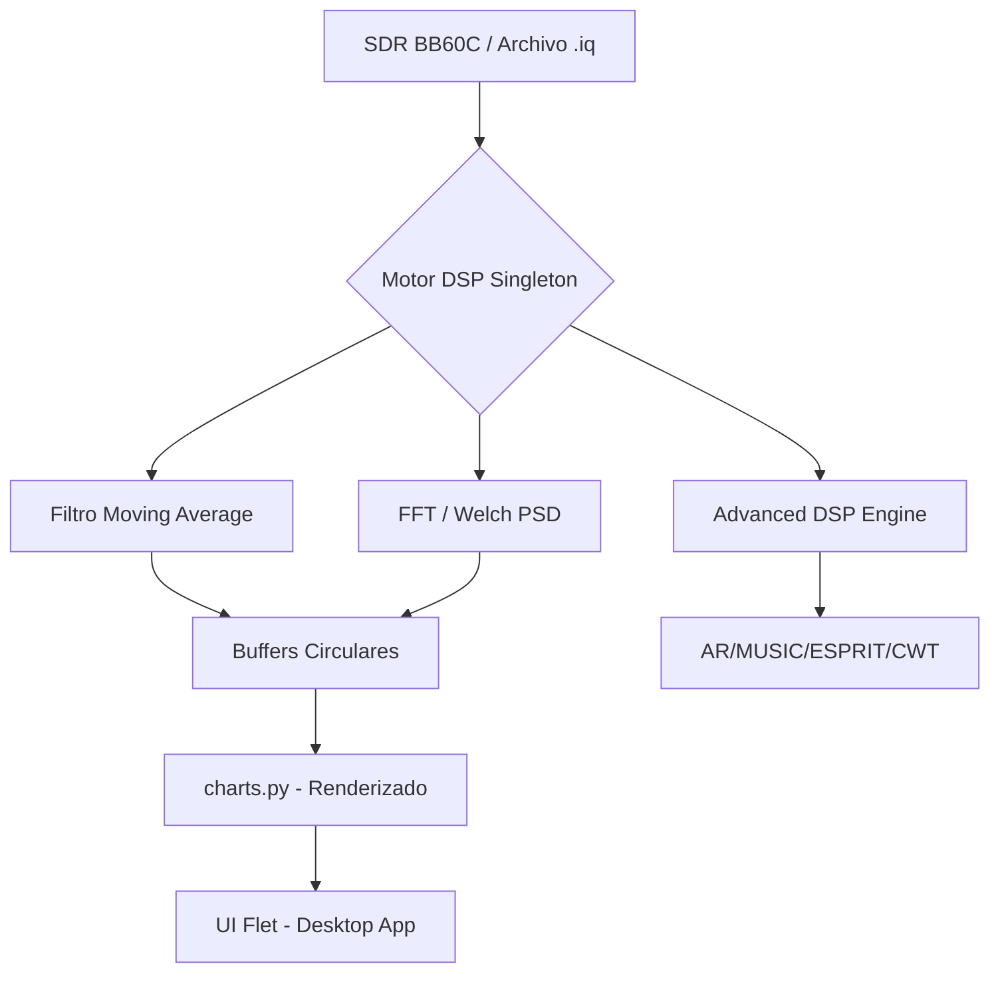

# UIC Radiotelescopio

Plataforma DSP avanzada para radioastronomía, optimizada para la detección de la línea de **Hidrógeno Neutro (HI) a 21cm / 1420.405 MHz**.

## Arquitectura de Flujo de Datos

## Componentes Principales

| Componente | Función |
|------------|-----------|
| **Core DSP** | Procesamiento multihilo de ráfagas I/Q en tiempo real. |
| **Smart Metadata** | Auto-detección de parámetros vía cabeceras JSON o análisis espectral de picos. |
| **Hardware Stability** | Gestión de bloqueos (Mutex) y manejo de warnings del BB60C para evitar desconexiones. |
| **Auto-Range Engine** | Ajuste dinámico de ejes (X/Y) basado en la estadística del buffer (Min/Max/Piso de Ruido). |
| **Persistence** | Guardado automático de todo el estado de la UI y hardware en `config.json`. |

## Estructura del Código

- `core/`: Motor DSP (`dsp_engine.py`), algoritmos avanzados (`advanced_dsp.py`), constantes de hardware.
- `ui/`: Interfaz de usuario reactiva con Flet.
- `ui/tabs/`: Módulos de visualización especializada (Espectro, Cascada, SNR, Smart Trigger).
- `ui/components/`: Layout global y widgets de diseño premium.
- `scripts/`: Utilidades para generación de señales sintéticas y pruebas.

## Especificaciones Técnicas

- **Backend**: Python 3.10+, NumPy (vectorizado), SciPy.
- **UI**: Flet (basado en Flutter) para una experiencia desktop premium.
- **Visualización**: Matplotlib con optimización de caché de artistas para ~30 FPS.
- **Hardware Soportado**: Signal Hound BB60C, RTL-SDR y Archivos IQ RAW.
- **Comunicación**: Sistema PubSub para sincronización asíncrona entre DSP e Interfaz.
